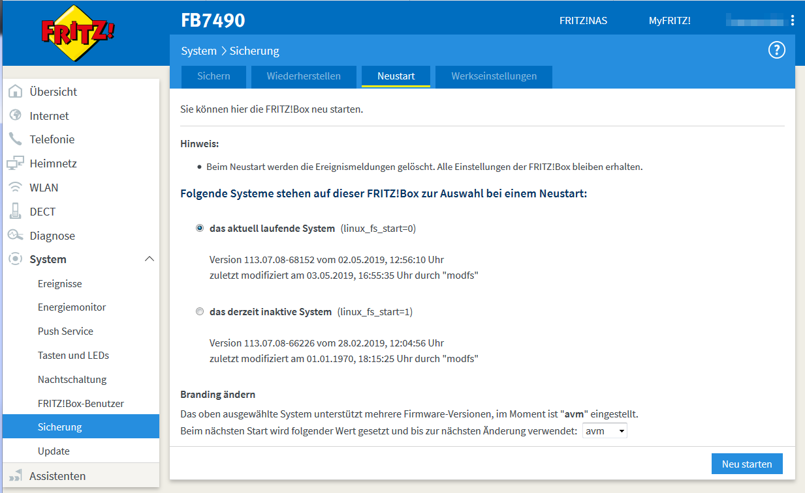

# Files in this folder

`bootmanager`

It's a shell script, intended to be called on a FRITZ!Box device with VR9/GRX500/Puma6 chipset, which has the ability to switch between two different installed operating systems. It's at the same time an attempt to equalize the special needs of each of these models, how to manage the installed filesystem images in SquashFS format.

It provides different modes of operation:

- generate the HTML and JS code needed to include its functions into vendor's restart page
- generate a list of current settings, which may be used by the caller to implement an own user interface
- switch the active system version and branding in a secure and reusable manner

German and English messages are included in the script, the default language is ```en``` and it will be switched by the environment setting from FRITZ!OS (```Language``` variable) to ```de```, if this value is present in the calling system.

The code checks, if any of the present systems was modified by a supported framework (```YourFritz```, ```Freetz``` or ```modfs```) and shows the date and time of last update, if it detects any of these frameworks. Finally, it's simply looking for the various version files and uses the file date and time of them to display the values.

To install it to your own firmware image, best copy it to location ```/usr/bin/bootmanager``` and set the wanted attributes and owner/group ID. The other files from here expect it there ... if you put it elsewhere, you probably have to change the location in other files, too.

`bootmanager.msg`

This file contains the text snippets used to display data collected by `bootmanager` to the user. Have a look at the file for the used format - if you want to supply another language, you may add the needed snippets to this file. A translation has to use its phrases in the same order - only the text parts will be replaced and format and order of variable parts isn't changeable here.

`bootmanager_server`

A shell wrapper script to provide access to `bootmanager` functions using simple file I/O functions (open/close, read and write). It provides output from `bootmanager get_values` via a FIFO at `/var/run/bootmanager/output` and reads     simple 'commands' from another FIFO at `/var/run/bootmanager/input`. An existing directory `/var/run/bootmanager` may be used as detector whether the server is running or not. For a list of supported 'server commands' have a look onto the header of this file. This file has to be copied to `/usr/bin/bootmanager_server` if the service definition file below should be used.

`bootmanager.service`

A service definition file for AVM's `supervisor` service, which runs the `bootmanager_server` from above. This file has to be copied to `/lib/systemd/system/bootmanager.service` in your own FRITZ!OS image.

`add_to_system_reboot.sh`

A shell script, which adds the needed code to AVM's files to integrate `bootmanager` into the 'Reboot' page from GUI. It supports the pre-07.08 approach, where HTML code is emitted from `reboot.lua` and also the newer one, where only JSON data gets generated. The injected Lua code prefers the usage of an existing `bootmanager_server` instance and if such one can't be found, it tries a fallback using `io.popen` and `os.execute`.

If your firmware image contains more than a single *branding*, you'll probably need to apply the patch to more than one sub-tree below ```/usr/www```.

The use of `sed` to change the original content forecloses any protection against double invocation for the same file and it's the caller's business to prevent errors from double-patch attempts.

Starting with version 0.8 this installation script copies the supplemantory files `bootmanager_server`, `bootmanager.service`, `bootmanager_html` (for FRITZ!OS versions below 07.08) and `bootmanager.msg` to the FRITZ!OS file structure specified by `$TARGET_DIR`.

You have to set the environment variables

- `TARGET_BRANDING` (e.g. `avm`)
- `TARGET_SYSTEM_VERSION` (e.g. `113.07.08`)
- `TARGET_DIR` (root of filesystem to modify) and
- `TMP` (a writable place in your system for a temporary file)

to the correct values, before you call this script.

Alternatively you may set `TARGET_SYSTEM_VERSION` to `autodetect`, as long as you specify the path to a script - usable as such a detector - in a variable named `TARGET_SYSTEM_VERSION_DETECTOR`. This script has to be interface-compatible to the provided script, which was placed in this directory via a symbolic link (`extract_version_values`) to the file, that is used in the `signimage` sub-directory to extract version values from a FRITZ!OS tree, needed for generation of a database with AVM's firmware signing keys.
But the used interface is _very_ simple - the script has to accept the path to the FRITZ!OS root directory as first parameter and has to handle or ignore a `-m` as the second parameter. The output is expected on STDOUT and has to contain a line starting with `Version="nnn.nn.nn"`, where the version number (nnn.nn.nn) may be extracted from.

`add_change_oem.sh`

This is a small shell script to inject code into a file from AVM's FRITZ!OS, which is responsible for most of actions regarding the "firmware branding" settings (via shell environment variable `OEM`). The added code checks the kernel command line for an entry `oem=<value>` and if it exists, the specified `<value>` is compared to every value supported by the running FRITZ!OS firmware. If a match was found, the specified value replaces the one read from urlader environment.

This script is an alternative approach to a 'fixed replacement', where the value is changed, but has to be specified at build time already. With this solution, you may add the needed entry to `kernel_args` or `kernel_arg1` in the urlader environment settings of AVM's EVA bootloader.

But be aware, that the loader of some models (especially the DOCSIS routers) limits the acceptable settings from these two variables - make sure first, that your device supports additional entries. After setting an own entry using the FTP server of EVA, you may verify the used kernel command-line at the support data file, if you get it soon enough after a restart to catch the very first kernel messages with the output of `dmesg`:

```
[...]
[    0.000000] PERCPU: Embedded 7 pages/cpu @81a06000 s7392 r8192 d13088 u32768
[    0.000000] Kernel command line: oem=avm console=ttyS0,115200n8r nor_size=0MB sflash_size=1024KB nand_size=512MB ethaddr=08:96:D7:XX:XX:XX  audit=1
[    0.000000] [NAND] nand_size = 0x20000000
[...]
```

If there's already a solution to change an - otherwise 'unchangeable', because the bootloader restores the original value at every start again - branding, what's the gain of another approach? Now - at first it's not a 'fixed' value any longer and it's planned, that future versions of `bootmanager` will support this solution, too, and then it will be possible again to select the `<value>` for the `oem` entry using the `bootmanager` interface in AVM's GUI.
